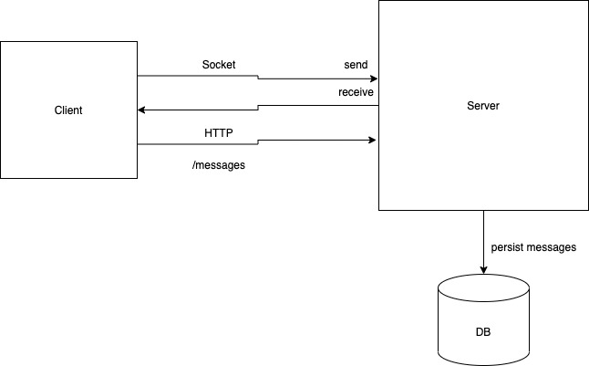

## Requirement

### Functional Requirements

1. Should be able to send message between users (sender <-> receiver)
2. Should be able to retrieve messages from a sender - last 100 messages or all messages in last 30 days.
3. Should be able to retrieve messages from all senders - last 100 messages or all messages in last 30 days

### Non-functional requirements

### Block diagram

### Sequence flow
